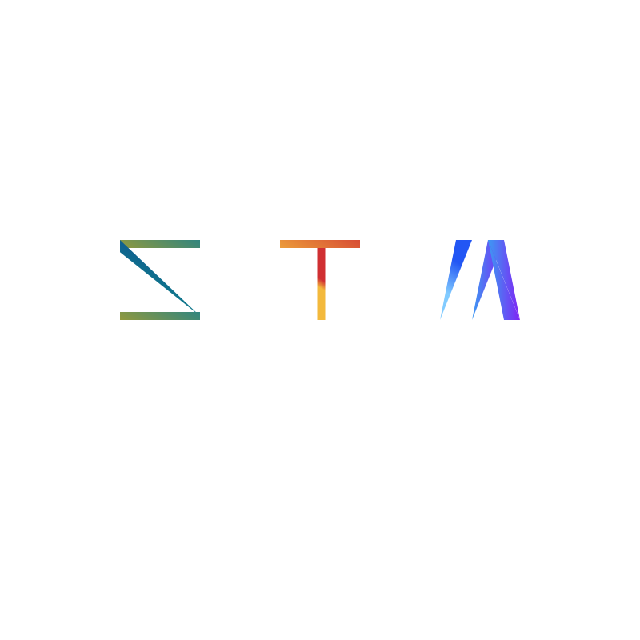

# Stamon2

## 关于Stamon2

* CLimber-Rong在2023年二月份开发了简陋的第一代Stamon。在2023年7月份，CLimber-Rong决定开发第二代——Stamon2（以下简称Stamon）
* Stamon是一门面向对象的动态编程语言。
* Stamon可移植性极高，只需要实现为数不多的依赖库，Stamon就可以在你的平台上运行。

## 下载发行版

目前Stamon的发行版存在于以下站点，你可以挑选一个最适合的站点下载Stamon：

* [Github Releases](https://github.com/CLimber-Rong/stamon/releases)
* [CLimber-Rong.github.io](https://CLimber-Rong.github.io/resource/stamon2/releases)
* [stamon-rsc.github.io](https://stamon-rsc.github.io/releases)

你也可以在 **Github Action** 中下载最新测试版。

我们希望更多人可以帮忙把Stamon的发行版挂载到自己的站点中，以此让更多地方可以流畅下载Stamon。

## 手动编译

见 [发行版编译指南](doc/发行版编译指南.md)。

## 运行方法

见 [发行版使用指南](doc/发行版使用指南.md)。

## 项目文档

文档位于doc目录里，如果你想要阅读每次提交的内容以及对源码的解释，请阅读``doc/工作日志``目录下的文档。

在阅读源码之前，可以先阅读[代码速览指南](doc/代码速览指南.md)，来了解本项目的一些误区和源码阅读顺序。

## 开源项目保护

本项目已加入开源项目保护宣言（MOSPP），我们建议开发者们遵守此宣言所倡导的开源精神（当然，这**只具有道德约束力**）。

为了防止本项目遭受学术抄袭，我们决定暂时采用异步更新：发行一个版本时，先发行可执行文件，再下一次版本更新时才推送此版本的源码（即源码始终比可执行文件慢一步发布）。

## 开发者

* CLimber-Rong [Github主页](https://github.com/CLimber-Rong) [Gitee主页](https://gitee.com/QuXiangrong)
* copi143 [Github主页](https://github.com/copi143)
* GusemFowage [Github主页](https://github.com/GusemFowage)
* min0911_ [Github主页](https://github.com/min0911Y)
* wenxuanjun [Github主页](https://github.com/wenxuanjun)

## 特别致谢

* TheFlySong [Github主页](https://github.com/TheFlySong)
* XIAOYI12 [Github主页](https://github.com/XIAOYI1212)
* 冻橘 [Github主页](https://github.com/MikanAffine)
